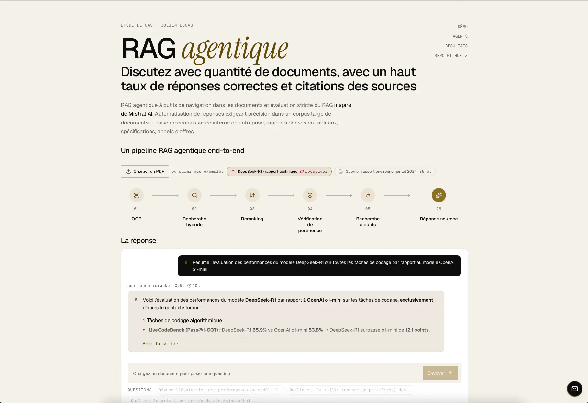

# RAG Agentique multi-agent avec outils de navigation dans documents indexés — évalué sur FinanceBench


Si vous appréciez, ajoutez une ⭐ au repo pour soutenir mon travail. 🙏

Ce système RAG combine un récupérateur hybride (BM25 + embeddings + reranking Cohere), un routage
par document et un modèle de réponse équipé d'outils (`search` / `grep` / `read_page`), sur des
rapports SEC de 150 à 260 pages. Il est **mesuré** sur
[FinanceBench](https://github.com/patronus-ai/financebench), le benchmark utilisé par Mistral pour
évaluer Agentic Search (150 questions). Le résultat qui compte est l'ablation, à retrieval
strictement identique : **83,3 % de réponses correctes avec les outils, contre 65,4 % sans**, et
des hallucinations qui passent de 26,9 % à 16,7 %. Dix-huit points gagnés par l'agent équipé, sur
le même index et les mêmes 10 passages initiaux. Le run complet coûte environ 0,30 € à relancer.
Tous les chiffres sont reproductibles à partir des sorties versionnées dans
`evaluation/financebench/outputs/` —
[résultats, coût et limites](#évaluation-financebench-documents-financiers-difficiles).

## Architecture IA à la base avant améliorations


### 1. **Agent Vérificateur de Pertinence**
Évalue si les passages récupérés répondent réellement à la question (CAN_ANSWER / PARTIAL / NO_MATCH). Son verdict ne bloque plus la génération : il est transmis au modèle de réponse comme indice (« le contexte initial a été jugé partiel, cherchez ce qui manque »).

### 2. **Agent de Recherche et de réponse, avec outils**
Le modèle de génération reçoit les 10 meilleurs passages et les [trois outils](#les-outils) décrits plus bas. Il répond directement si le contexte suffit ; sinon il cherche — en voyant chaque résultat avant de décider du suivant, 5 appels au plus — et répond **dans la même conversation** : le modèle qui cherche est celui qui répond, comme dans l'[Agentic Search](https://mistral.ai/news/agentic-search/) de Mistral. Les outils sont disponibles sur **toutes** les questions ; le mode conditionnel (agent de recherche séparé, ou réécriture de la question) reste disponible pour comparaison via `GENERATOR_TOOLS_ENABLED` et `CORRECTIVE_MODE`.

### 3. **Génération contrainte**
La réponse ne s'appuie que sur les passages numérotés — initiaux ou ramenés par les outils — avec une citation `[n]` après chaque affirmation, et refuse quand l'information n'y est pas. Deux règles de prompt tirées des runs FinanceBench : un ratio ou une marge dont les composantes sont dans le contexte se **calcule** (formule, chiffres cités, résultat) ; et « non disponible » ne s'écrit qu'après un `grep` sans résultat.

## Cet agent a des outils à dispo

Trois opérations façon système de fichiers, données au modèle de réponse. Les pages OCR sont conservées entières (`backend/retriever/page_store.py`) à côté des chunks : les chunks servent à *trouver*, les pages à *lire*.

| Outil | Ce qu'il fait |
|---|---|
| `search(query, doc)` | Le retrieval hybride du pipeline (BM25 + vecteurs, routage, rerank Cohere), relancé avec une nouvelle requête, optionnellement restreint à un document. Renvoie 8 extraits avec document et page. |
| `grep(pattern, doc)` | Occurrences littérales d'un motif (regex, insensible à la casse), page par page, sur tout le document. Exhaustif : 0 résultat permet d'affirmer qu'un terme n'y figure pas. |
| `read_page(doc, page, end_page)` | La page entière telle que l'OCR l'a produite, tableau compris — ce qu'un chunk de 1 200 caractères ne montre jamais. `end_page` lit 2 à 3 pages d'un coup pour un tableau à cheval. |

Chaque passage ramené par un outil reçoit un numéro `[n]`, affiché dans le résultat, que la réponse cite comme les autres. Les 10 passages initiaux gardent leurs numéros : les outils ne peuvent qu'**ajouter** après eux. Le rapport de vérification renvoyé avec chaque réponse liste les appels effectués.

### Le système inclut un retriever hybride pour maximiser la pertinence
- **Algo BM25 + Embeddings** : Recherche texte classique à forte précision lexicale + Recherche sémantique capturant le sens contextuel. L'index vectoriel déclare explicitement sa métrique (`VECTOR_SPACE = "cosine"`) : le défaut de Chroma est `l2`, qui n'est correct que tant que les embeddings sont normés.
- **Routage par document** : avant de chercher, le système cible le(s) document(s) que la question désigne (nom d'entreprise ou de fichier) — indispensable quand plusieurs documents longs sont indexés ensemble.
- **Reranking Cohere + parent-child + multi-query** : petits chunks pour matcher, gros chunks pour répondre.

## Stack de modèles
- ⚡ Mistral OCR 4
- 🧠 Mistral Embed (embeddings)
- 🧠 Cohere Rerank v4 Pro multi-langue
- 💎 Mistral Large (recherche à outils + génération) + Mistral Small (sous-agents : pertinence, routage, multi-query)

## Installation

1. **Cloner le projet** :
```bash
git clone https://github.com/julienlucas/agentic-rag-with-tools
```

2. **Installer les dépendances** :
```bash
uv sync
```

3. **Configuration** :
Allez sur https://console.mistral.ai pour créer votre clé.

Puis créer un fichier `.env` avec vos clés ([console.mistral.ai](https://console.mistral.ai) et [dashboard.cohere.com](https://dashboard.cohere.com)) :
```bash
MISTRALAI_API_KEY=votre_clé_api_mistral_ici
COHERE_API_KEY=votre_clé_api_cohere_ici
```

Pour surveiller votre application avec LangSmith (si vous le souhaitez) :

1. **Créer un compte LangSmith** : Allez sur [smith.langchain.com](https://smith.langchain.com)

2. **Obtenir votre clé API** : Dans les paramètres de votre compte

3. **Ajouter vos variables d'environnement**
```bash
# Configuration LangSmith pour le monitoring
LANGSMITH_API_KEY=votre_cle_api_langsmith_ici
LANGSMITH_PROJECT=agentic_rag_multi_agent
```

4. **Lancer l'application** :
```bash
uv run python manage.py runserver
```

## Évaluation FinanceBench (documents financiers difficiles)

L'évaluation, sur [FinanceBench](https://github.com/patronus-ai/financebench) (Patronus AI) —
le benchmark utilisé par [Mistral pour évaluer Agentic Search](https://mistral.ai/news/agentic-search/) :
QA sur des filings SEC de 150 à 260 pages, denses en tableaux.

**Préparation, l'indexation des documents (une seule fois, ~10-20 min)** — télécharge, OCRise et met en cache 4 10-K (AMD, American Express, Boeing, PepsiCo) :
```bash
uv run python evaluation/financebench/prepare.py
```

**Lancer l'évaluation (5-10 min)** :
```bash
uv run python evaluation/financebench/run_financebench_eval.py --mode both
```

**Résultats** — run du 4 septembre 2026 (soir), versionné dans `evaluation/financebench/outputs/`.
26 questions, 4 filings, index combiné, juge LLM au protocole du benchmark, comptages bruts.
Les deux premières lignes sont l'ablation : même index, même retrieval, mêmes 10 passages
initiaux, la seule différence est le modèle de réponse avec ou sans outils.

| | Correctes | Hallucinations | Refus |
|---|---|---|---|
| Ce RAG, **avec** les outils (search / grep / read_page) | **83,3 % (20/24)** | 16,7 % (4/24) | 0 |
| Ce RAG, **sans** les outils (même retrieval, une seule génération) | 65,4 % (17/26) | 26,9 % (7/26) | 2 |
| Mistral Agentic Search — repère externe (Medium 3.5, 150 questions) | 86 % | | |
| Outils RAG juridiques commerciaux (étude Stanford) | 42-65 % | 17-33 % | |
| RAG naïf — papier FinanceBench (GPT-4-Turbo 2023, benchmark complet) | ~19 % | 81 % de réponses fausses ou refusées | |

**Pourquoi 24 et non 26 sur la ligne avec outils.** Deux questions (AMD, American Express) ont
échoué techniquement en mode avec outils — timeout ou LLM indisponible pendant la boucle d'appels,
pas une mauvaise réponse. Le protocole les compte à part et les sort du dénominateur, pour ne pas
les confondre avec des refus. Comptées comme fausses, la ligne serait à 76,9 % (20/26) : toujours
onze points au-dessus du même système sans outils. Le chiffre canonique du projet est **83,3 %
(20/24)**.

Les lignes Mistral, Stanford et papier FinanceBench portent sur des échantillons différents de ce
RAG : ce sont des repères d'ordre de grandeur, pas un match à armes égales. Avec 26 questions,
l'intervalle de confiance à 95 % fait une trentaine de points : la comparaison qui tient est celle
des deux premières lignes, pas l'écart de trois points avec Mistral.

**Coût.** Le runner compte les tokens facturés de chaque appel (génération, sous-agents, juge LLM)
et les unités de recherche Cohere, et écrit le total dans `financebench_summary.json` (`cost`).
Mesuré le 5 septembre 2026 sur un run complet (26 questions, les deux modes, juge LLM compris) :

| Poste | Volume | Coût |
|---|---|---|
| Mistral Large (réponse avec et sans outils, juge) | 422 k tokens en entrée, 29 k en sortie | 0,25 $ |
| Mistral Small (sous-agents) | 30 k tokens | 0,005 $ |
| Cohere Rerank 4 Pro | ~35 recherches à 0,0025 $ | 0,09 $ |
| **Un run complet** (4 à 5 minutes) | | **≈ 0,35 $ ≈ 0,30 €** |
| Préparation, une seule fois (OCR de 1 074 pages, embedding de 12 400 chunks) | | 4,4 $ ≈ 3,8 € |

Grille publique La Plateforme et Cohere du 5 septembre 2026, 1 $ = 0,86 €. Autrement dit :
l'évaluation complète, reproductible, sur quatre 10-K, se relance pour le prix d'un café, et le
chiffre de précision qu'on annonce à un client est re-mesurable à chaque changement de prompt.


Détail du protocole, options et notes d'implémentation : [`evaluation/financebench/README.md`](evaluation/financebench/README.md).
